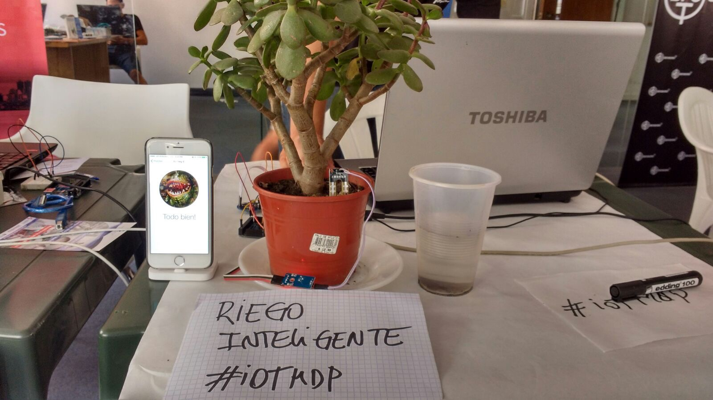
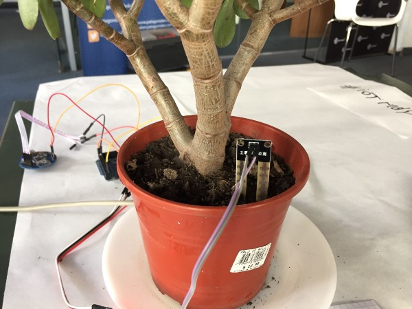
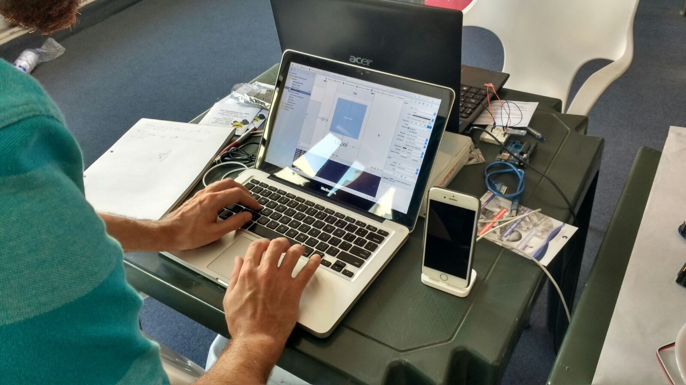
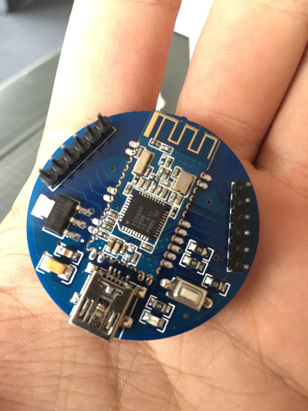

# Making active members of your team out of your office plants

Ever since we moved to our first office we knew that having nice and healthy plants would help us to bring a livable and positive atmosphere to the workplace. We got a few of them and put them in nice and well lit places around the office. We only had to water them from time to time and that was it!
Not being plant people ourselves, we kinda neglected them. Some would get too much water too frequently and others would get just a fraction of what they actually needed. Without proper care, the sight of decaying, dry plants caused the opposite effect that we initially intended. Unfortunately not all of them made it until the end of that year. It would have been great if they could simply tell us when they need water, right? But plants can’t talk… or can they?

## The idea

On February 12, 2016 an Internet of Things hackathon was held in our city by [SUMA Conectivo](https://web.archive.org/web/20160426044837/http://sumaconectivo.org/index.html). Together with [Lucas](https://twitter.com/lmtreser) and [Jose Luis](http://www.roboticaeducativa.com/) we decided to find a solution to this problem. Even though many solutions already exist, we did it the same because we enjoyed the challenge and we knew that we could find a nice solution together. The idea was to develop both an Internet of Things (IoT) solution to give plants the ability to tell us when they were thirsty.
The idea of having plants that can talk to us and tell us when they are hungry inmediately reminded me of the classic Little Shop of Horrors movie, so the project was called Seymour as an homage to the flower shop attendant who took care of Audrey II, a hungry plant with a very special taste for food.

## The solution

The project consists of several components. Two metallic pins are inserted in the dry dirt of a flower pot. Since there is a direct relation between humidity and conductivity, we used an Arduino to read conductivity levels at periodic intervals.

Each reading got sent to a bluetooth module. My iPhone would connect via bluetooth to it, receive those readings and interpret them for me. In the end, I got to know if the plant was doing well or not with a simple tap on the screen. Easy, right?

## The problem

Thanks to Lucas’ expertise we completed the hardware implementation quite quickly. Then we found the first showstopper: our bluetooth module was somewhat old and didn’t comply with BLE (low energy Bluetooth) specifications. iOS devices can not connect to Bluetooth devices older than version 4 due to Apple restrictions that aim to improve battery life. Without newer hardware we were unable to move forward!

Luckily the guys from [PatagoniaTec](https://patagoniatec.com/) loaned us a HM-Sensor. This device is bluetooth version 4 compliant and it can relay to a BLE host any data that you can read with the Arduino.

*The HM-Sensor is a BLE module that is capable of sending and receiving information via Serial-over-Bluetooth.*

Once that part was fixed, we had to build the iPhone app. Its development was divided in two parts: detecting the device and displaying the state of the plant. The first part was easy because we only had to look for a device with a previously known ID. Since this was a quick and dirty solution we simply hardcoded this value into the app instead of building an online database of plants as any real application would need.
Displaying the state of the plant relied on experimentation. The measurements were defined in the 0–1023 interval, so we subdivided that interval in segments. Any value below 400 would make our plant say «I’m drowning!» while any value higher that 950 would make it say «I’m thirsty!». Add a few sound files and you’ve got a speaking plant!

## Something extra

The hackaton was almost over and the projects were already on display when Jose Luis had the idea to integrate a recycled pump from an old ink-jet printer to the project. A low humidity level automatically fired up the water pump which would then water the plant. Once a higher humidity level was reached, the pump was automatically stopped. The cycle was complete!

## The future

This project could be greatly improved if we replaced the hardcoded ID value with a real database so that we could identify an indefinitely large number of plants. A base station built with something like a Raspberry Pi could read all information from every plant and upload it to the cloud, allowing anyone to check their state from far away. Push notifications could let us know exactly when each plant needs watering. We could even manually trigger the water pump to make sure that they get an exact number of water droplets!
Both the iOS and Arduino project code is freely available at [Github](https://github.com/leandrinux/seymour) so feel free to improve on it or let us know your comments.

## The Autor

Este texto fue redactado por **Leandro Tami.** iOS developer, computer security enthusiast, hopeless gamer.

* [Artículo original en Medium](https://medium.com/lateral-view/making-active-members-of-your-team-out-of-your-office-plants-ac4209fba0a5)

* [Fork en Automatismos Mar del Plata](https://www.automatismos-mdq.com.ar/blog/2016/02/making-active-members-of-your-team-out-of-your-office-plants.html)
